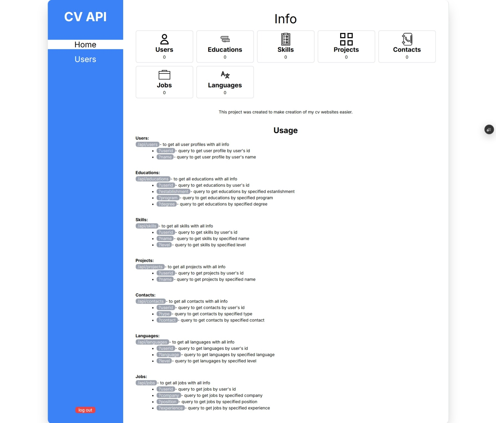
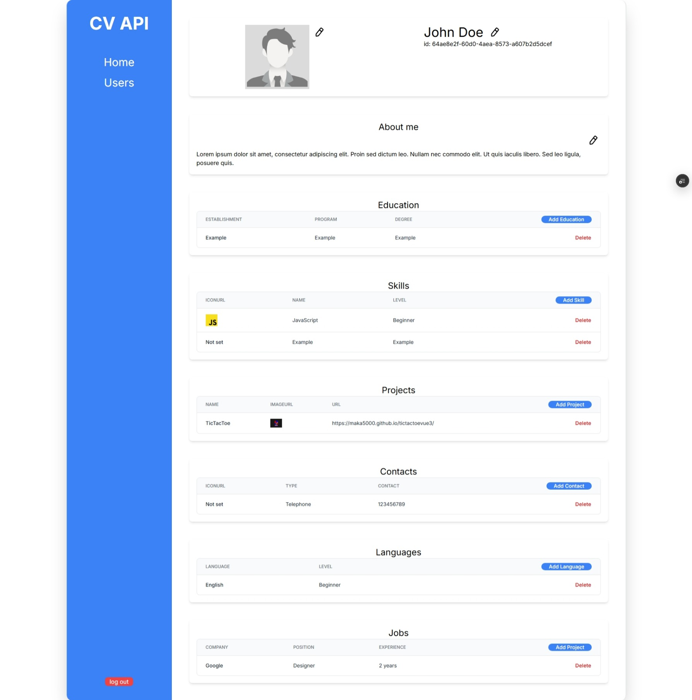

# 🧾 nextjs-cv-api

A responsive CV editor built with **Next.js (App Router)**, **TypeScript**, and **Tailwind CSS**.  
This project allows updating CV content dynamically through an editable form and API routes.

## Project's URL

https://nextjs-cv-api.vercel.app/

## 🚀 Features

- 🌐 Server-side rendered with App Router (Next.js 13+)
- 📑 Editable CV form with real-time updates
- 🔧 API routes to fetch and update data
- 🎨 Tailwind CSS for rapid styling and layout
- 🗂️ Clean folder structure and component-based architecture

## 📸 Screenshots

### Main CV Page  


### Users Page

Adding new user

### Profile view


## 🛠 Tech Stack

- Next.js 13+ (App Router)
- TypeScript
- Tailwind CSS
- React Hooks & Forms
- Postgress

## 📂 Getting Started

```bash
git clone https://github.com/Maka5000/nextjs-cv-api
cd nextjs-cv-api
npm install
npm run dev
